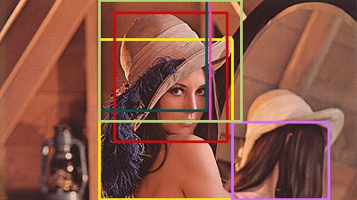

Selective Search for Object Recognition
=======================================

Python implementation of the algorithm described in the paper Selective Search for Object Recognition.
https://ivi.fnwi.uva.nl/isis/publications/bibtexbrowser.php?key=UijlingsIJCV2013&bib=all.bib

    Selective Search for Object Recognition
    J. R. R. Uijlings, K. E. A. van de Sande, T. Gevers, A. W. M. Smeulders
    International Journal of Computer Vision 2013.

Usage
-----

    python SelectiveSearch.py sigma k min_size smallest largest distortion input_image_file output_image_file
    
    ex)
    python SelectiveSearch.py 0.5 500 50 6000 10000 1.25 ./example/lena.jpg ./example/lena_result.jpg

Result
------

 
